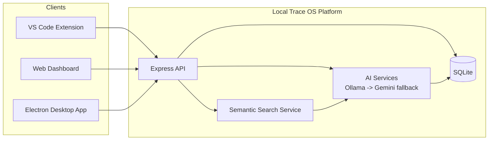

# Trace OS

Trace OS is a privacy-first, local-first developer context intelligence system that captures activity from inside the editor, stores it in a local SQLite database, and turns that data into searchable context, focus-session summaries, architectural decisions, and standup-ready updates.

It is built as a multi-surface product: a VS Code extension for capture and workflow actions, a local Express API with AI and semantic-search services, a React web dashboard for analysis, and an Electron desktop shell for a native workspace view.

## Documentation Package

- [Project Brief](docs/project-brief.md)
- [Architecture](docs/architecture.md)
- [API Reference](docs/api-reference.md)
- [Presentation Pack](docs/presentation-pack.md)
- [Setup and Run](docs/setup-and-run.md)

## Quick Facts

| Category | Details |
| --- | --- |
| Product type | Agentic AI system / developer productivity platform |
| Architecture | Hybrid local-first monolith with multi-client front ends |
| Main clients | VS Code extension, web dashboard, Electron desktop app |
| Backend | Node.js + Express |
| Database | SQLite via `better-sqlite3` |
| AI layer | Ollama first, Gemini fallback |
| Search | Embedding-based semantic ranking with cosine similarity |
| Deployment model | Runs locally on the developer machine |

## What Trace OS Does

Trace OS records the signals that usually disappear during development work: file edits, terminal commands, git commits, focus sessions, and architecture decisions. The server enriches that raw activity with embeddings and AI-generated summaries, then exposes the data through the dashboard and extension webviews.

The result is a system that can answer questions such as:

- What was I working on in this file?
- Which files were touched during the last focus session?
- What should I include in today’s standup?
- What decision led to this implementation path?
- What related activity or files should I review next?

## Core Value

Trace OS is designed to reduce context loss without pushing source content to the cloud by default. Local storage, local embeddings, and local AI generation are the default path. When local AI is unavailable, the system can fall back to Gemini for text generation while still preserving the local data model and access patterns.

## System At a Glance

## Key Capabilities

- Activity capture from editor, terminal, and git events.
- Semantic search across activity and architectural decisions.
- File-level context briefs with caching.
- Focus-session start and end tracking with AI summaries.
- Standup generation from recent activity.
- Decision logging with embeddings for retrieval.
- Local admin reset for development and demos.

## Implementation Snapshot

- The server exposes `/api/health`, `/api/activity`, `/api/context`, `/api/search`, `/api/decisions`, `/api/focus`, `/api/standup`, and `/api/admin`.
- The VS Code extension registers a sidebar with Context, Standup, Search, Focus, and Decisions views.
- The dashboard uses a command-palette UX, activity feed, focus timer, graph views, and standup modal.
- The Electron app reuses the same API and UI patterns as the web dashboard.

## How To Use This Repo

1. Read [Project Brief](docs/project-brief.md) for the product story and technical summary.
2. Read [Architecture](docs/architecture.md) for the system design and data model.
3. Read [API Reference](docs/api-reference.md) for the endpoint contract.
4. Use [Presentation Pack](docs/presentation-pack.md) for viva, interview, and demo delivery.
5. Follow [Setup and Run](docs/setup-and-run.md) for local execution.