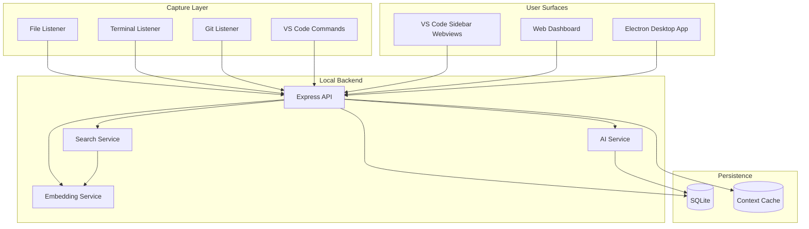
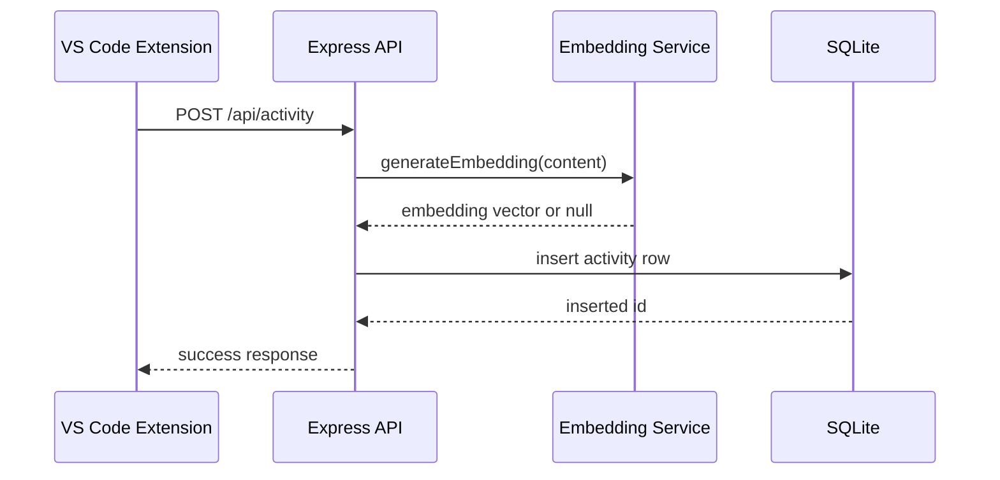
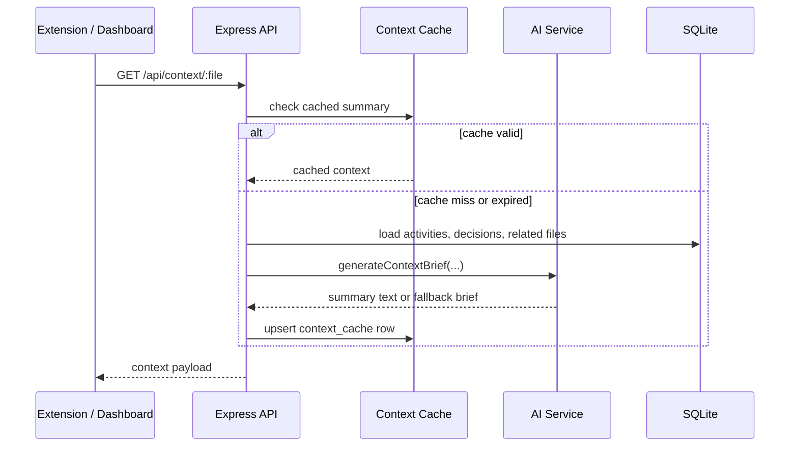

# Architecture

## Overview

Trace OS uses a local client-server architecture. The VS Code extension captures workflow signals, the Express server stores and enriches them, and the dashboard/Electron surfaces present the resulting context. SQLite is the persistence layer, Ollama is the preferred AI runtime, and Gemini is the fallback generation path.

## Component Responsibilities

| Component | Responsibility |
| --- | --- |
| VS Code extension | Captures activity, exposes sidebar webviews, and runs command shortcuts |
| Express server | Central API, validation, routing, AI orchestration, and persistence |
| SQLite database | Stores activities, decisions, focus sessions, and cached context briefs |
| AI service | Builds context briefs, standups, and focus summaries |
| Embedding service | Generates embeddings and performs cosine similarity ranking |
| Search service | Normalizes activities and decisions into a shared ranking space |
| Web dashboard | Visualizes activity, focus, search, decisions, and system health |
| Electron app | Desktop-friendly mirror of the dashboard experience |

## Data Model

The schema is intentionally compact and optimized for local use.

| Table | Purpose | Key Fields |
| --- | --- | --- |
| `activities` | Stores all captured developer events | `type`, `file_path`, `project`, `content`, `metadata`, `embedding`, `created_at` |
| `decisions` | Stores architecture and product decisions | `title`, `description`, `rationale`, `files_affected`, `tags`, `embedding`, `created_at` |
| `focus_sessions` | Stores deep-work sessions and summaries | `task_name`, `started_at`, `ended_at`, `summary`, `files_touched`, `status` |
| `context_cache` | Stores file-level summary cache entries | `file_path`, `context`, `generated_at`, `expires_at` |

## Key Workflows

### 1. Activity Capture

Capture events are constrained to approved activity types:

- `file_open`
- `file_save`
- `file_close`
- `terminal_command`
- `git_commit`
- `focus_start`
- `focus_end`
- `decision_logged`

Each event is stored with a timestamp, optional file path, metadata payload, and embedding.

### 2. Context Resume

The context route uses a 4-hour cache window and includes:

- recent file-specific activity
- related decisions referencing the file
- related files discovered from project activity

### 3. Standup Generation

The standup route gathers activity from a requested time window, groups it into files edited, commits, and focus sessions, and sends the structured payload to the AI service.

Fallback behavior returns a deterministic standup summary if AI generation is unavailable.

### 4. Focus Sessions

Focus sessions are stateful records with a single active session constraint.

- `POST /api/focus/start` creates an active session.
- `POST /api/focus/end` closes the session and asks AI to summarize the work.
- `GET /api/focus` lists historical sessions.
- `GET /api/focus/active` returns the currently active session or `null`.

When a session ends, the server collects activities recorded since the start time, extracts touched files, and stores the generated summary plus completion metadata.

### 5. Search

Search combines activities and decisions into a single semantic ranking pipeline.

1. The server loads activities and decisions from SQLite.
2. The query is embedded using Ollama.
3. Each candidate item is scored with cosine similarity.
4. Results are returned with a normalized content field and score.

If the embedding request fails, the system falls back to a simpler keyword match on stored content.

## Privacy and Security Model

Trace OS is intentionally conservative.

- Data is stored locally by default.
- The server does not require external authentication in the current codebase.
- The API is bound for local developer use, not public multi-tenant exposure.
- The Gemini fallback sanitizes file-path-like content before sending prompts externally.
- The admin clear endpoint is explicit and destructive by design, intended for local development and demos.

## Reliability Notes

- Ollama generation has a short availability check and a fallback path.
- Embedding generation returns `null` instead of crashing the workflow when the local model is unavailable.
- Search falls back to keyword matching if embeddings cannot be produced.
- The context cache avoids recomputing summaries on every request.
- The dashboard periodically refreshes recent activity and focus state.

## Extensibility Points

The current architecture is straightforward to extend in several directions:

- Add auth or workspace-specific tenancy.
- Expand the capture surface with more activity types.
- Store richer relationship graphs for file-to-file traceability.
- Replace the current semantic ranking with vector indexing if scale increases.
- Add export features for reports, retrospectives, or compliance snapshots.